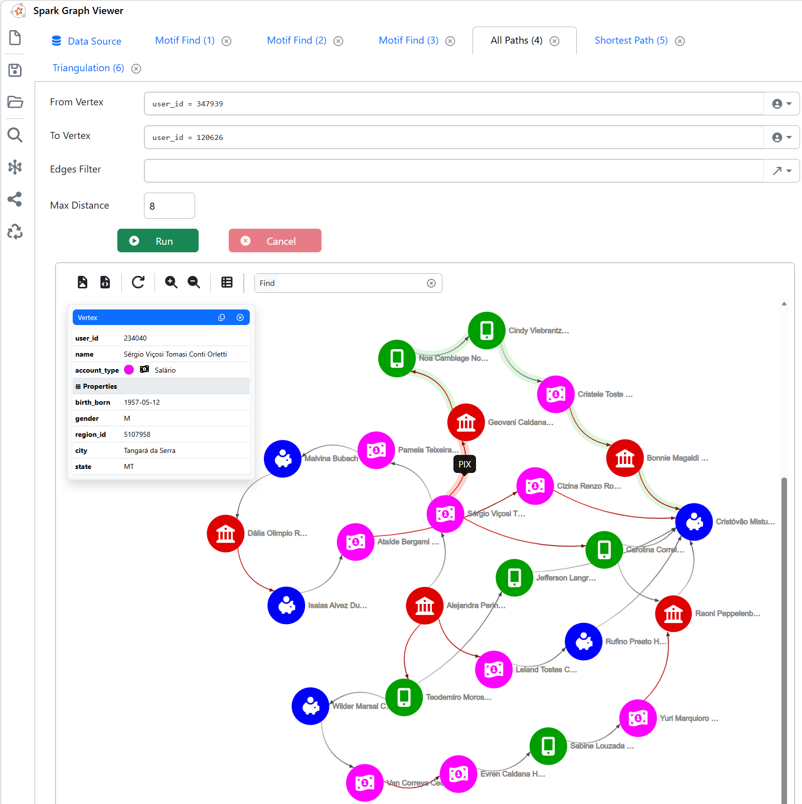

  
  Spark Graph Viewer

  <i>Turn your data into visual insights with Apache Spark - simple, fast, and interactive.</i>

  

## 1. Overview

***Spark Graph Viewer*** provides an intuitive, powerful interface for processing and visualizing directed graphs within the *Apache Spark* ecosystem. It eliminates the need to write complex code, enabling you to explore connections and patterns quickly and interactively.

Designed to make graph analysis accessible, visual, and extremely fast.

### ✨ What Makes *Spark Graph Viewer* Special?
***No-code Simplicity*** – Forget about writing intricate Python or PySpark scripts. Build directed graphs intuitively without altering your existing data structure. Just link your:

* **Vertices**: Your data points.
* **Edges**: Connections (source and destination) between them.

### 🔍 Powerful, Simplified Queries
No complex syntax required. Perform advanced searches in just a few clicks:

* **MOTIF Pattern**: Structural search with custom filters on vertex and edge fields.
* **Shortest Path**: Find the quickest route between two points.
* **All Paths**: Map every possible connection between two vertices.
* **Cycle Search**: Detect loops where the start and end points are the same.

### 🎨 Advanced Visualization & Customization
Bring your data to life with a rich interface:

* **Interactive Graphs**: Drag, zoom, and explore every connection visually.
* **Custom Design**: Assign icons and colors to vertices and edges.
* **Property Inspection**: Click any element to view its details and metadata.
* **Sequencing View**: Easily visualize chains and edge sequences.

### 📤 Export & Flexibility
Take your results wherever you need:

* Export the graph visualization as an **SVG** (vector) file.
* Extract processed data in **JSON** format.
* Use the quick search tool to locate specific vertices on the map.

### 🎯 How It Works

1. **Connect your data**: Point to your vertex and edge tables.
2. **Configure the view**: Choose the colors and icons that best reflect your business domain.
3. **Explore**: Use the search engine to uncover paths, patterns, and hidden insights.

 

## 2. Technologies Used
* Web standards: HTML5, CSS3, and JavaScript.
* [Apache Spark](https://spark.apache.org/)
* [D3.js](https://d3js.org/)
* [Bootstrap](https://getbootstrap.com/)
* [jQuery](https://jquery.com/)

 

## 3. Contributing
See [*CONTRIBUTING.md*](CONTRIBUTING.md) for details about the code of conduct and the pull request process.

 

## 4. License
This project is licensed under the MIT License. See [*LICENSE*](LICENSE.txt) for details.

 

## 5. Contact

If you have questions, suggestions, or just want to chat about the project, feel free to reach out:

* **Email**: <i>&#97;&#110;&#116;&#111;&#110;&#105;&#111;&#100;&#110;&#64;&#103;&#109;&#97;&#105;&#108;&#46;&#99;&#111;&#109;</i>
* **LinkedIn**: [*`https://www.linkedin.com/in/antonio-domingues-neto-4a3bb4145`*](https://www.linkedin.com/in/antonio-domingues-neto-4a3bb4145/)

